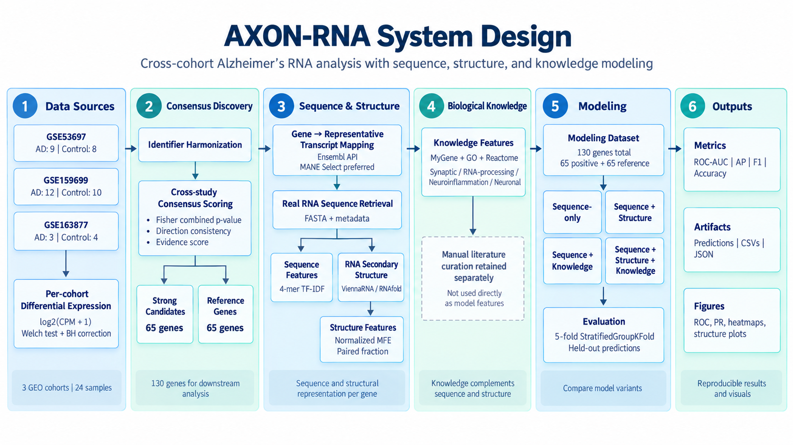

# AXON-RNA

**Cross-cohort Alzheimer’s RNA analysis using sequence, secondary structure, and biological knowledge.**

AXON-RNA is an exploratory research project that asks whether RNA sequence, predicted secondary structure, and biological annotations can help prioritize genes that show reproducible dysregulation across independent Alzheimer’s disease (AD) brain transcriptomic cohorts.

The current experiment contains **65 strong consensus candidates** and **65 reference genes**. Results are intentionally reported conservatively: the sequence-only model achieved ROC-AUC **0.507**, while adding RNA structure increased ROC-AUC to **0.567**. These are gene-level held-out results—not patient diagnosis, isoform-level discoveries, validated biomarkers, or evidence of clinical utility.

See [`VALIDATION.md`](VALIDATION.md) for exact validation details.


---

## Research question

> Can RNA sequence, secondary structure, and biological knowledge improve prioritization of reproducibly dysregulated genes in Alzheimer’s disease compared with sequence-only representations?

The broader question concerns RNA dysregulation, but this implementation tests a narrower proxy: **prediction of strong gene-level consensus membership using one representative transcript per gene**. The analysis therefore does not establish which transcript isoform changed in the original tissue samples.

---

## System design

The pipeline moves from independent AD brain transcriptomic cohorts to cross-study consensus discovery, representative transcript mapping, RNA sequence and structure analysis, biological knowledge features, and held-out model evaluation.



---

## Why this matters

Independent postmortem brain studies can disagree because of tissue composition, disease stage, sampling, technical variation, and cohort size. AXON-RNA first searches for genes with reproducible directional changes across cohorts and then asks whether properties of their representative RNAs provide additional predictive signal.

Sequence composition, RNA folding, and functional annotations describe different aspects of the same gene. Comparing them under the same evaluation framework makes it possible to test whether added biological information helps rather than assuming that a more complex representation must perform better.

---

## Related work and inspiration

AXON-RNA is **not a reproduction of a single published paper**. It was developed as an independent research-engineering project informed by several established areas:

- cross-cohort transcriptomic analysis in Alzheimer’s disease;
- RNA sequence representation and RNA language models;
- RNA secondary-structure prediction;
- functional annotation with Gene Ontology and pathway databases;
- integration of biological knowledge with machine-learning models.

Core public tools and resources used by the project include:

- **NCBI GEO** — public transcriptomic datasets;
- **Ensembl / MANE Select** — representative transcript mapping;
- **ViennaRNA / RNAfold** — RNA secondary-structure prediction;
- **MyGene.info** — programmatic gene annotation;
- **Gene Ontology (GO)** — functional biological annotations;
- **Reactome** — pathway knowledge.

RNA foundation models such as **RNA-FM** are relevant inspiration for future extensions, but **no pretrained RNA foundation model contributes to the results reported here**.

---

## Datasets

| GEO cohort | Tissue recorded in project | AD libraries | Control libraries | Tested genes |
|---|---|---:|---:|---:|
| [GSE53697](https://www.ncbi.nlm.nih.gov/geo/query/acc.cgi?acc=GSE53697) | Dorsolateral prefrontal cortex | 9 | 8 | 17,812 |
| [GSE159699](https://www.ncbi.nlm.nih.gov/geo/query/acc.cgi?acc=GSE159699) | Temporal lobe; region-bearing sample names | 12 | 10 older controls | 23,206 |
| [GSE163877](https://www.ncbi.nlm.nih.gov/geo/query/acc.cgi?acc=GSE163877) | Middle temporal gyrus | 3 | 4 | 29,509 |

GSE159699’s eight young-control libraries are excluded. Its repeated donor/sample identifiers require a donor/region audit before the libraries can be treated as fully independent biological replicates.

A fourth cohort, [GSE125583](https://www.ncbi.nlm.nih.gov/geo/query/acc.cgi?acc=GSE125583), is reserved as a possible future validation cohort and does not contribute to the current results.

---

## Cross-study consensus discovery

The screening analysis performs:

1. library-size normalization;
2. `log2(CPM + 1)` transformation;
3. Welch tests within each cohort;
4. Benjamini–Hochberg adjustment within each cohort;
5. cross-study evidence integration using Fisher’s method;
6. direction-consistency scoring across studies.

The evidence score used in the discovery stage is:

```text
abs(median_log2fc) × direction_consistency × (0.5 + significant_fraction)
```

The harmonized analysis contains:

- **36,907** unique genes across the study union;
- **13,738** genes measured in all three cohorts;
- **1,255** consensus-positive genes;
- **65** strong candidates satisfying all three of the following:
  - measured in all three cohorts,
  - fully consistent effect direction,
  - combined p-value < 0.01,
  - absolute median effect ≥ 0.5.

“Strong” refers to this filtering rule. It is not an independently validated biological label.


---

## Representative transcript mapping

The expression measurements are gene-level. For sequence-based analysis, each selected gene is mapped to one representative Ensembl transcript.

Selection strategy:

1. prefer **MANE Select** when available;
2. otherwise use the explicit Ensembl canonical transcript;
3. retrieve spliced cDNA;
4. convert DNA `T` to RNA `U`;
5. validate sequence length and alphabet.

Mapping succeeded for:

- **65/65 candidate genes**;
- **130/130 modeling genes**;
- **127 MANE Select transcripts**;
- **3 canonical fallbacks**.

Representative transcript sequence is an analysis input. It is **not evidence that the selected isoform itself was dysregulated in the original AD tissue**.

---

## RNA secondary structure

RNA structure is computed with **ViennaRNA / RNAfold 2.7.2** at 37°C using default energy parameters.

For each representative transcript, the model uses the first:

```text
min(1,000, transcript length)
```

nucleotides.

The structure feature table records:

- minimum free energy (MFE);
- normalized MFE;
- paired-base fraction;
- full-sequence GC content;
- folded-window GC content;
- dot-bracket structure;
- folded coordinates;
- truncation status.

Only **normalized MFE** and **paired-base fraction** are used as structure-model features.

Six example RNA structures are visualized in `results/rna_structures/real/`.


These are computational predictions, not experimentally measured in-vivo RNA structures.

---

## Biological knowledge features

Both candidate and reference genes receive equivalent MyGene queries using mapped human Ensembl gene IDs.

The modeled knowledge features are:

| Feature | Rule |
|---|---|
| `go_synaptic` | GO term contains `synap` |
| `go_rna_processing` | GO terms match RNA processing/splicing, spliceosome, rRNA, or tRNA processing |
| `go_neuroinflammation` | GO terms match inflammation, microglia, immune, or cytokine keywords |
| `go_neuronal` | GO terms match neuron, axon, dendrite, or synapse keywords |
| `go_count` | Number of distinct returned GO term names |
| `pathway_count` | Number of distinct source-qualified pathway names |

These are broad annotation proxies rather than claims of AD-specific mechanism.

Manual and automated literature curation are retained for interpretation and audit, but **literature-derived features are excluded from all reported predictive models** because the curation coverage is not equivalent between classes.

---

## Modeling dataset

The modeling set contains:

- **65 strong consensus candidates**;
- **65 reference genes** sampled from genes measured in all three cohorts that are not consensus-positive;
- **130 total genes**.

Reference genes are not proven biologically unaffected genes. The balanced set is a controlled pilot evaluation and does not represent transcriptome-wide disease prevalence.

Each gene receives one held-out prediction using the same five `StratifiedGroupKFold` splits. Exact duplicate sequences are kept in the same fold.

---

## Models

All models use logistic regression with a sequence representation based on **4-mer character TF-IDF**.

Four model variants are compared:

1. **Sequence only**
2. **Sequence + structure**
3. **Sequence + knowledge**
4. **Sequence + structure + knowledge**

TF-IDF, numeric imputation, and scaling are fitted independently inside each training fold to avoid preprocessing leakage.

Differential-expression statistics, evidence scores, gene names, transcript IDs, literature evidence, and mapping status are excluded from the predictive feature set.

---

## Results

| Model | ROC-AUC | Average precision | F1 | Accuracy |
|---|---:|---:|---:|---:|
| Sequence | 0.507219 | 0.518625 | 0.518519 | 0.500000 |
| Sequence + structure | **0.567337** | **0.593838** | **0.558140** | **0.561538** |
| Sequence + knowledge | 0.521420 | 0.526670 | 0.461538 | 0.515385 |
| Sequence + structure + knowledge | 0.547929 | 0.541395 | 0.504202 | 0.546154 |

The clearest numerical improvement comes from adding structure features:

```text
ROC-AUC: 0.507 → 0.567
```

Knowledge features produce a smaller change:

```text
ROC-AUC: 0.507 → 0.521
```

Adding both structure and knowledge does not outperform structure alone.

These differences are **descriptive results on one small selected dataset**. They do not establish a statistically reliable benefit from structure or knowledge.


---

## Reproducibility

### Requirements

- Python ≥ 3.10
- ViennaRNA with `RNAfold` and `RNAplot` available on `PATH`

Install Python dependencies:

```bash
pip install -r requirements.txt
```

Verify ViennaRNA:

```bash
RNAfold --version
```

### First run on a fresh clone

The repository does **not** commit raw GEO downloads or local HTTP/RNAfold caches.

A fresh clone should therefore populate the required public-data caches first:

```bash
python scripts/real_data/run_real_pipeline.py
```

This step requires network access to the public Ensembl/MyGene services used by the pipeline.

### Reproducible offline rerun

After caches have been populated locally:

```bash
python scripts/real_data/run_real_pipeline.py --offline
```

Run the test suite:

```bash
pytest -q
```

Current validation:

```text
12 passed
```

`results/run_manifest.json` records source/input hashes and package versions.  
`results/reproducibility_check.json` records reproducibility checks.  
`results/test_output.txt` contains the most recent automated test output.

See [`VALIDATION.md`](VALIDATION.md) for the full validation summary.

---

## Repository structure

```text
AXON-RNA/
├── README.md
├── VALIDATION.md
├── requirements.txt
├── pyproject.toml
│
├── data/
│   └── real/
│       ├── processed/
│       ├── sequences/
│       ├── structures/
│       └── modeling/
│
├── docs/
│   └── assets/
│       └── Flow.png
│
├── results/
│   ├── figures/
│   ├── rna_structures/
│   ├── consensus_genes.csv
│   ├── strong_candidates.csv
│   ├── model_comparison.csv
│   ├── model_predictions.csv
│   ├── knowledge_feature_importance.csv
│   ├── reproducibility_check.json
│   └── run_manifest.json
│
├── scripts/
│   ├── run_discovery.py
│   └── real_data/
│
├── src/
│   └── axon_rna/
│
└── tests/
```

Raw GEO files and local caches are intentionally excluded from version control.

---

## Limitations

The main limitations are:

- small selected modeling set;
- gene-level rather than isoform-level labels;
- simplified differential-expression screening;
- possible donor dependence in cohort metadata;
- no cell-composition adjustment;
- unmatched reference expression levels;
- broad annotation features and annotation-coverage bias;
- sequence homology may cross evaluation folds;
- RNA structure is predicted only from the 5′ window up to 1,000 nt;
- no untouched external validation cohort;
- no formal paired significance test for model differences.

The current results should therefore be interpreted as **exploratory research evidence**, not clinical or mechanistic conclusions.

---

## Next steps

Planned research extensions include:

- donor/region metadata auditing;
- covariate-aware differential-expression modeling;
- combined-test FDR analysis;
- expression- and biotype-matched references;
- repeated or homology-aware evaluation;
- validation on an untouched external cohort;
- transcript-level / isoform-aware quantification;
- systematic literature curation across both classes;
- optional comparison with pretrained RNA foundation-model embeddings.

---

## Project status

The classical AXON-RNA pipeline is complete and validated locally.

- 130/130 representative transcripts mapped
- 130/130 RNAfold predictions completed
- 5-fold held-out predictions generated for all genes
- 12 automated tests passing
- reproducibility and provenance manifests generated
- RNA foundation-model stage remains optional future work

For exact metrics, implementation checks, and remaining caveats, see [`VALIDATION.md`](VALIDATION.md).
