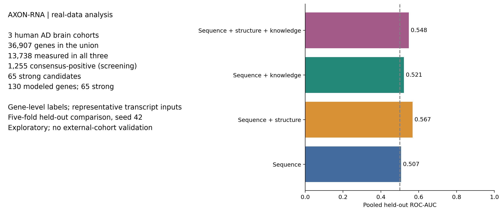
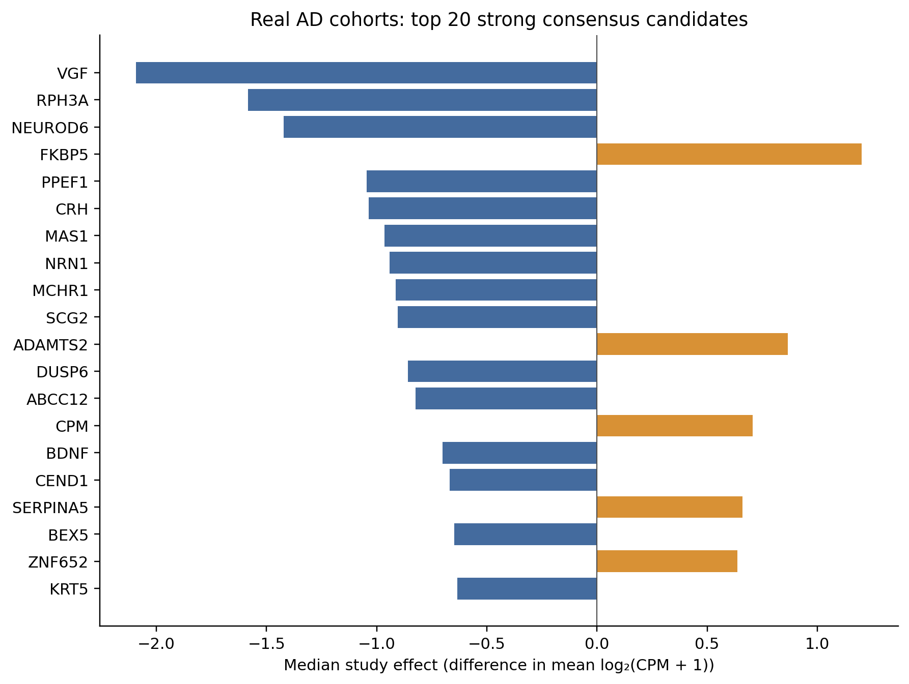
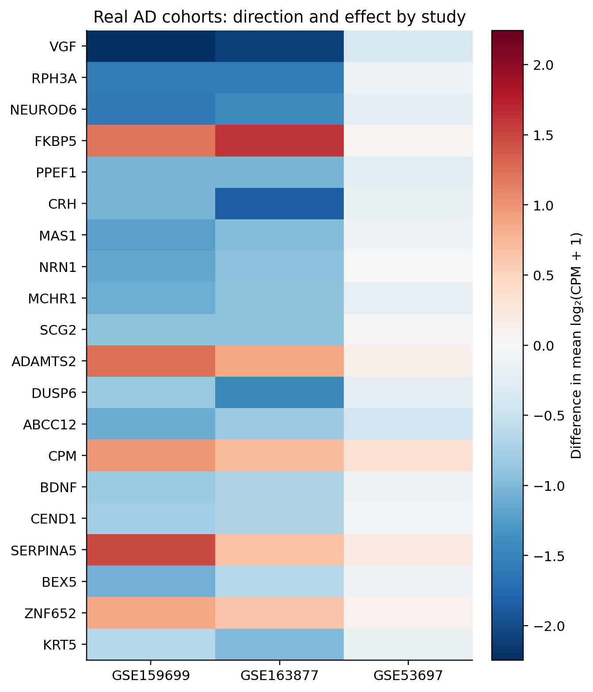
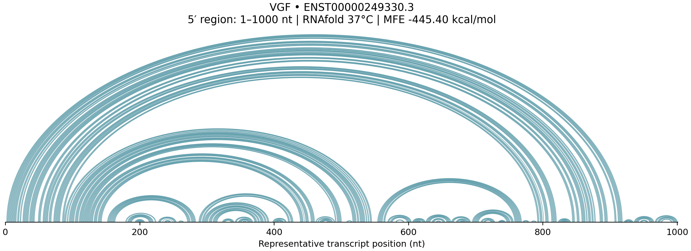
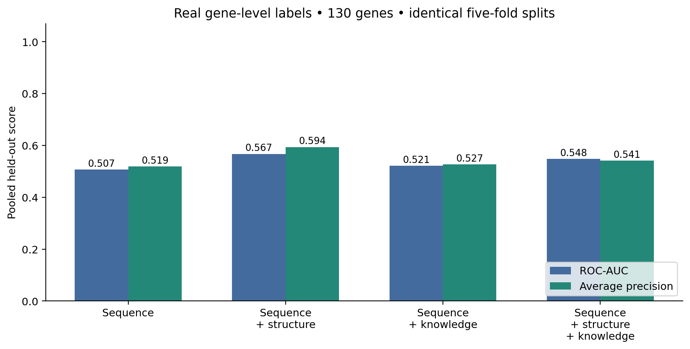
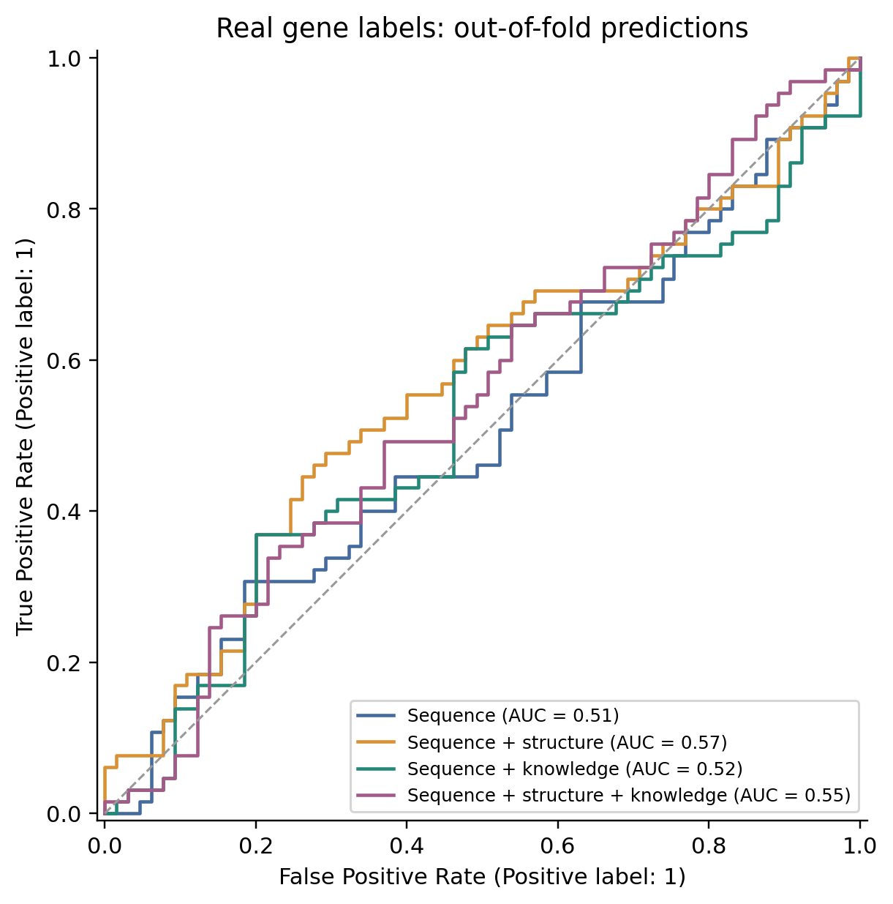
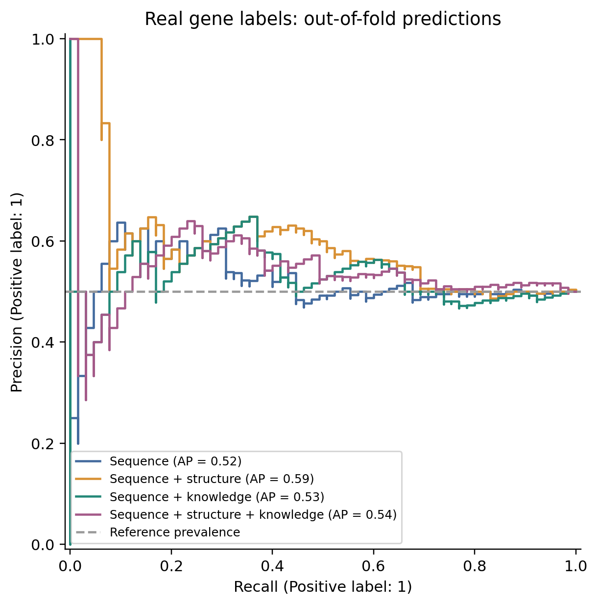
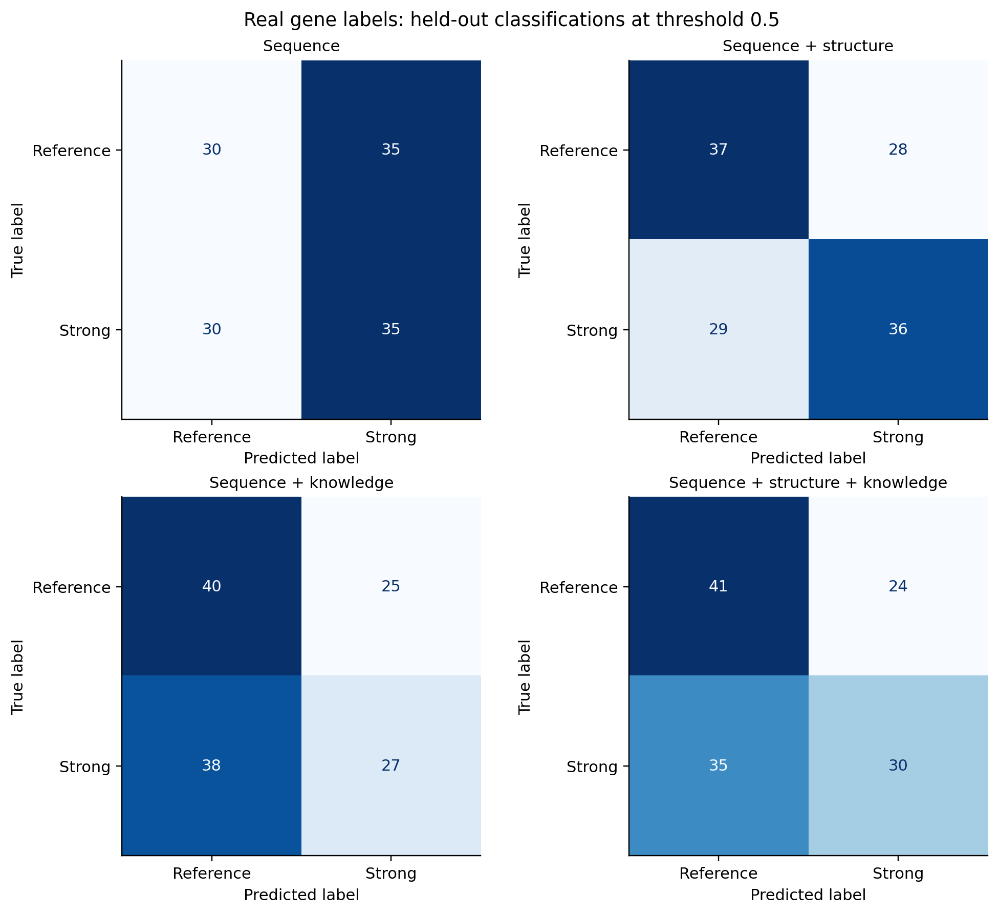
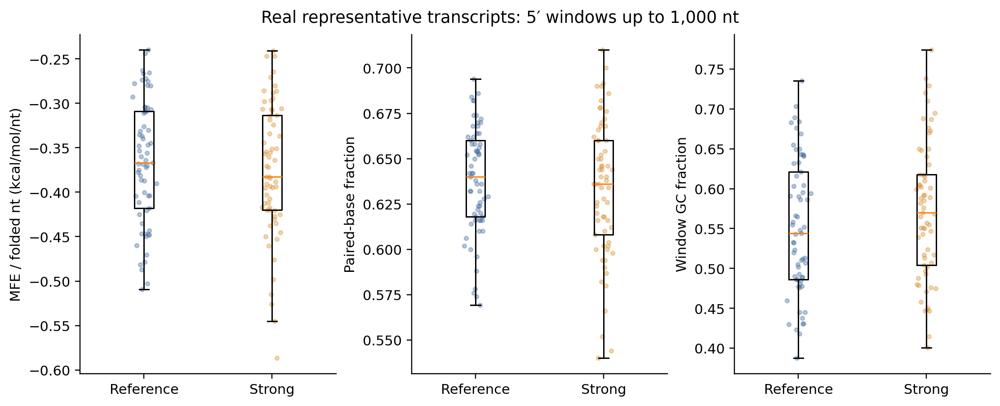
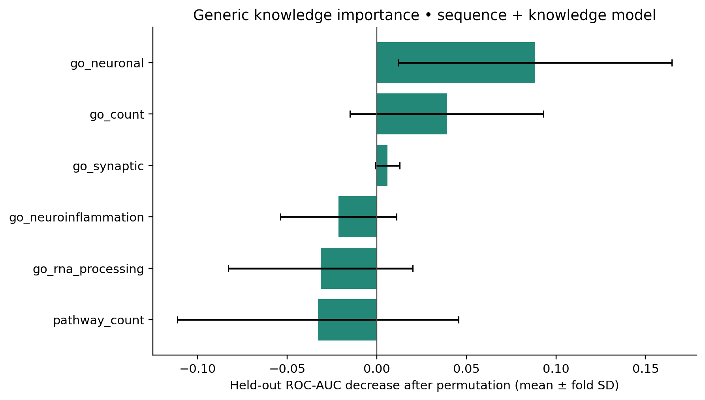

# AXON-RNA

AXON-RNA is an exploratory research portfolio on RNA dysregulation in human Alzheimer’s disease (AD) brain tissue. It combines an existing three-cohort gene-expression screen with real representative transcript sequences, ViennaRNA folding, and generic biological annotations.

**The real-data classical pipeline is complete and reproducible from cached inputs.** The current experiment contains 65 strong consensus candidates and 65 reference genes. Its results are modest: sequence-only ROC-AUC is 0.507; adding structure gives 0.567. These are gene-level, held-out results—not patient diagnosis, isoform-level discoveries, or validated biomarkers. See [final status](VALIDATION.md) for validation and exact metrics.



## Problem and research question

Individual postmortem brain studies can disagree because of sampling, tissue composition, disease stage, and technical differences. AXON-RNA first asks which genes show reproducible directional changes across cohorts, then tests whether properties of their representative RNAs help prioritize that selected gene set.

> Can RNA sequence, secondary structure, and biological knowledge improve prioritization of reproducibly dysregulated transcripts in Alzheimer’s disease compared with sequence-only representations?

That is the broader research question. **This implementation tests a narrower proxy: prediction of strong gene-level consensus membership using one representative transcript per gene.** It cannot establish which transcript isoform changed.

## Why this matters

Sequence composition, RNA folding, and annotated biological functions provide different descriptions of a gene. Comparing them under the same evaluation makes it possible to test whether added information helps, without assuming that a larger or more complicated model is better. A weak result is useful here: it limits what can responsibly be inferred from this small dataset.

## Real datasets and cohort overview

The analysis preserves the existing processed cohort files. Counts below describe libraries used in those files, not necessarily unique donors.

| GEO cohort | Tissue recorded in project | AD libraries | Control libraries | Tested genes |
|---|---|---:|---:|---:|
| [GSE53697](https://www.ncbi.nlm.nih.gov/geo/query/acc.cgi?acc=GSE53697) | Dorsolateral prefrontal cortex | 9 | 8 | 17,812 |
| [GSE159699](https://www.ncbi.nlm.nih.gov/geo/query/acc.cgi?acc=GSE159699) | Temporal lobe; region-bearing sample names | 12 | 10 older controls | 23,206 |
| [GSE163877](https://www.ncbi.nlm.nih.gov/geo/query/acc.cgi?acc=GSE163877) | Middle temporal gyrus | 3 | 4 | 29,509 |

GSE159699’s eight young-control libraries are excluded. Its A/T sample suffixes and repeated numeric identifiers require a donor/region audit before treating libraries as independent biological replicates. The supplied registry originally said 11 AD samples; it has been corrected to the 12 AD libraries found in the count matrix and processed analysis. [GSE125583](https://www.ncbi.nlm.nih.gov/geo/query/acc.cgi?acc=GSE125583) remains a future validation cohort and contributes no results here.

## Method and cross-study consensus

The existing screen computes library-size normalized log2(CPM + 1), compares group means with Welch tests, and applies within-cohort Benjamini–Hochberg adjustment. The stored `log2fc` is a difference in mean log-transformed abundance, not a count-model coefficient. This is preliminary screening, without clinical covariates or cell-composition adjustment.

`src/axon_rna/discovery.py` combines study p-values with Fisher’s method and calculates direction consistency and an evidence score:

`abs(median_log2fc) × direction_consistency × (0.5 + significant_fraction)`

The existing consensus-positive rule is: at least two studies, direction consistency ≥0.75, and combined p <0.05. The preserved output contains:

- **36,907** unique genes in the union;
- **13,738** measured in all three cohorts;
- **1,255** consensus-positive genes;
- **65** strong candidates: all three cohorts, fully consistent direction, combined p <0.01, and absolute median effect ≥0.5.

The strong rule does not require individual-cohort FDR significance, and Fisher-combined p-values have not been adjusted across genes. “Strong” identifies a filtering rule, not an independently validated biological status. Validation recomputes consensus from `all_real_studies.csv` and checks equality with the preserved table.




## Gene-level measurements and sequence mapping

Historical real DE/consensus files use a column named `transcript_id` for **gene symbols**. New modeling files rename this field to `gene` and reserve `transcript_id` for a versioned Ensembl transcript accession.

`scripts/real_data/fetch_real_sequences.py` queries the public [Ensembl lookup API](https://rest.ensembl.org/documentation/info/symbol_lookup) with expanded transcript and MANE information. It selects MANE Select when available, otherwise the gene’s explicit Ensembl canonical transcript. It never chooses an arbitrary longest transcript. It retrieves spliced cDNA, converts T to U, checks sequence length against exon lengths, and rejects ambiguous bases instead of deleting them.

All **65/65 candidates** mapped: **64 MANE Select, one canonical fallback**. All **130/130 modeling genes** mapped: **127 MANE Select, three canonical fallbacks**. The sequence table includes gene ID, versioned transcript ID, selection method, assembly, resolved symbol, source URLs, sequence, length, and mapping status. HTTP responses include retrieval timestamps and are cached unchanged.

- Candidate CSV/FASTA: `data/real/sequences/real_candidate_sequences.*`
- Both classes: `data/real/sequences/real_model_sequences.*`
- Audit summary: `data/real/sequences/mapping_summary.json`

A representative transcript is not evidence that this particular isoform is expressed in the sampled tissue or dysregulated in AD. Isoform-specific claims require transcript-level quantification.

## RNA structure

`scripts/real_data/fold_real_sequences.py` uses **RNAfold 2.7.2**, 37°C, default energy parameters, and `--noPS`. There is no synthetic or proxy fallback in the real pipeline.

Every gene uses the **first min(1,000, transcript length) nucleotides** of its representative RNA, with one-based inclusive coordinates recorded. All 130 folds succeeded. Ten transcripts fit entirely within the window; 120 were windowed. Full transcript lengths range from 104 to 21,157 nt. The full fetched sequences remain available.

`data/real/structures/real_structure_features.csv` records MFE, MFE divided by **folded length**, paired-base fraction, full-sequence GC, window GC, dot-bracket structure, coordinates, truncation flag, version, and status. Only normalized MFE and paired fraction enter the structure model. GC is descriptive; it is not counted as a structural improvement.

The six requested candidates have RNAplot SVGs and arc-diagram PNGs under `results/rna_structures/real/`. These depict exactly the folded windows used in modeling. Windowed folding omits distant interactions and is not an in-vivo structure measurement.



## Modeling dataset and class balance

Positive genes are the 65 strong candidates defined above. References are a fixed-seed sample of 65 genes from the **13,005 genes measured in all three cohorts that are not consensus-positive**. Sampling sorts the eligible pool by gene and uses seed 42. Other consensus-positive genes are excluded, rather than mislabeled as references.

No expression abundance field is available in the consensus table, so the reference set is not expression-matched. Three-cohort coverage provides a basic information requirement. Mapping/folding failures are retained in the dataset with an inclusion flag; no silent replacement sampling occurs. There were no failures in this run.

The balanced set is a manageable pilot, not an estimate of population prevalence. References are not proven unaffected genes. Average precision and predicted probabilities cannot be interpreted at transcriptome-wide prevalence without a different evaluation. All labels, DE statistics, sequences, structures, and knowledge fields are retained in `data/real/modeling/real_model_dataset.csv`; only explicitly allowed inputs enter models.

## Knowledge augmentation

Both classes receive equivalent [MyGene queries](https://docs.mygene.info/en/latest/doc/query_service.html) for GO terms and pathways, using mapped human Ensembl gene IDs. All 130 queries succeeded. This avoids using old candidate annotations for positives while querying a different source or time point only for references. The existing enriched annotations are preserved as `prior_go_terms` and `prior_pathways` for audit.

The six modeled features are:

| Feature | Deterministic rule |
|---|---|
| `go_synaptic` | A GO term contains `synap` |
| `go_rna_processing` | GO terms match RNA processing/splicing, spliceosome, rRNA, or tRNA processing |
| `go_neuroinflammation` | GO terms match inflammation, microglia, immune, or cytokine keywords |
| `go_neuronal` | GO terms match neuron, axon, dendrite, or synapse keywords |
| `go_count` | Number of distinct returned GO term names |
| `pathway_count` | Number of distinct source-qualified pathway names |

These are broad annotation proxies, not assertions of AD-specific mechanism. A zero means no matching returned annotation. Failed queries remain missing; absence of annotation does not establish absence of biological function.

Manual and automated literature remain separate columns and source files. Manual strength is encoded as strong=3, moderate=2, limited=1; **unclear and unreviewed remain missing**, with raw categories retained. For individual evidence flags, yes=1, no=0, limited=1, and unclear=missing; this is an ordinal convenience, not a probability. Human, mechanistic, tau, amyloid, synaptic and inflammatory fields remain auditable. Automated hits retain their own prefixes.

**Literature fields are excluded from all reported models.** They were reviewed/screened primarily for positive candidates, so using their coverage would reveal the label. Some papers also concern expression studies related to the discovery question. Existing citations are inherited curation, not newly verified literature claims.

## Modeling comparison and results

Each model uses 4-mer character TF-IDF and logistic regression (`C=1`, balanced class weights, maximum 3,000 iterations). Generic numeric inputs use median imputation and standard scaling. **TF-IDF, imputation, and scaling are fitted separately within each training fold.** DE statistics, evidence score, gene names, transcript IDs, literature, and mapping status are excluded from features.

All four models use the same five `StratifiedGroupKFold` splits with seed 42. Exact duplicate sequences are kept together. Each gene receives one held-out prediction; folds are saved in `data/real/modeling/cv_splits.csv`. Homologous genes are not clustered. There is no hyperparameter search or threshold optimization.

| Model | ROC-AUC | Average precision | F1 | Accuracy |
|---|---:|---:|---:|---:|
| Sequence | 0.507219 | 0.518625 | 0.518519 | 0.500000 |
| Sequence + structure | 0.567337 | 0.593838 | 0.558140 | 0.561538 |
| Sequence + knowledge | 0.521420 | 0.526670 | 0.461538 | 0.515385 |
| Sequence + structure + knowledge | 0.547929 | 0.541395 | 0.504202 | 0.546154 |

These are pooled out-of-fold metrics on 130 genes; F1/accuracy use threshold 0.5. Structure increases ROC-AUC by **0.060118**. Knowledge increases ROC-AUC by **0.014201**, while reducing F1. Adding both does not outperform structure alone. The experiment does **not** establish a robust benefit from knowledge or a statistically reliable structural improvement. Fold-level metrics are saved; no external validation or formal paired significance test has been completed.

Knowledge importance is held-out permutation importance: 20 permutations per fold for the sequence-plus-knowledge model, summarized as mean ROC-AUC decrease with fold standard deviation. It measures model reliance, not causality.








## Limitations and next research directions

The main limitations are selected-set size, gene-level labels, unadjusted combined significance, simple DE screening, possible donor dependence, tissue/cell composition, unmatched reference expression, annotation coverage bias, sequence homology across folds, and windowed folding. Random gene cross-validation is not validation in an untouched cohort: every label was derived from the same three-cohort screen.

Next steps are a donor/region metadata audit, covariate-aware DE appropriate to each count matrix, combined-test FDR analysis, expression/biotype-matched references, repeated or homology-grouped evaluation, and an untouched external cohort. Transcript-level quantification and isoform-aware validation would be needed to answer the broader research question directly. Literature features need equivalent blinded curation in both classes before predictive use.

RNA-FM extraction is optional. Torch is available locally, but `rna-fm` and pretrained weights are not installed. `extract_rna_embeddings.py --check` reports this without downloading weights; no embeddings or foundation-model metrics were fabricated. Actual extraction, if separately installed, uses CPU and a documented 1,000-nt window. Embedding comparisons remain future work.

## Reproducibility and how to run

From the repository root, use Python ≥3.10 and an environment with RNAfold/RNAplot on PATH:

```bash
pip install -r requirements.txt
RNAfold --version
python scripts/real_data/run_real_pipeline.py --offline
pytest -q
```

The offline command rebuilds sequence tables, folds, annotations, models, plots, and final validation from the preserved real consensus and local caches. Without populated caches, run once without `--offline` to access public Ensembl/MyGene services. Cached responses are reused; a new database snapshot requires deliberately archiving/replacing the cache, not silently refreshing it. The runner updates only the new real pipeline artifacts and its real figures.

Stages can also be run individually:

```bash
python scripts/real_data/fetch_real_sequences.py --include-reference
python scripts/real_data/fold_real_sequences.py
python scripts/real_data/build_real_dataset.py
python scripts/real_data/train_real_models.py
python scripts/real_data/plot_real_results.py
python scripts/real_data/extract_rna_embeddings.py --check
python scripts/real_data/validate_real_project.py
```

`results/run_manifest.json` records input/source/cache SHA-256 hashes and installed package versions. `results/test_output.txt` contains the latest test report. Validation checks consensus reconstruction, prediction membership and scores, duplicate-sequence fold isolation, structural lengths, and required figures. Tests cover selection, mapping helpers, sequence validation, missing evidence, folding, joins, and fold-local preprocessing.


## Repository structure and demo separation

```text
data/real/raw/                 supplied GEO matrices
data/real/processed/           preserved DE and harmonized study tables
data/real/sequences/           actual human representative RNAs, CSV + FASTA
data/real/structures/          actual RNAfold features and coordinates
data/real/modeling/            selected genes, annotations, dataset, CV folds
data/real/cache/               timestamped HTTP responses and RNAfold output
scripts/real_data/             real ingestion and modeling commands
src/axon_rna/real_data.py      mapping, selection, feature and join helpers
src/axon_rna/real_modeling.py  fold-local estimators and shared split logic
results/real_*                 real results and provenance
results/figures/real_*.png     real figures (plus project_summary.png)
results/rna_structures/real/   real RNA window illustrations
tests/                        existing tests and real-pipeline tests
data/demo/                    synthetic inputs only
```

**Synthetic demo artifacts are not AD findings.** The original scripts remain usable, and existing outputs were retained in place to avoid breaking them. `results/README.md` and directory-level README files identify the boundary. In particular, `results/consensus.csv`, `demo_predictions.csv`, `foundation_metrics.json`, `knowledge_metrics.json`, unprefixed model figures, and `TX*.png` structures belong to the synthetic demo. The legacy file name `foundation_metrics.json` does not prove a pretrained foundation model ran. Demo preprocessing/results are software examples and are not used for real-data claims or fair-model comparison.

To exercise the separate synthetic workflow:

```bash
python scripts/make_demo_data.py
python scripts/run_discovery.py --input data/demo/studies.csv --output results/consensus.csv
python scripts/run_foundation.py --consensus results/consensus.csv --sequences data/demo/sequences.csv --output results/foundation_metrics.json
python scripts/run_knowledge.py --consensus results/consensus.csv --sequences data/demo/sequences.csv --knowledge data/demo/knowledge.csv --output results/knowledge_metrics.json
python scripts/make_all_visuals.py
```

None of these demo commands contributes to the real metrics reported above.
